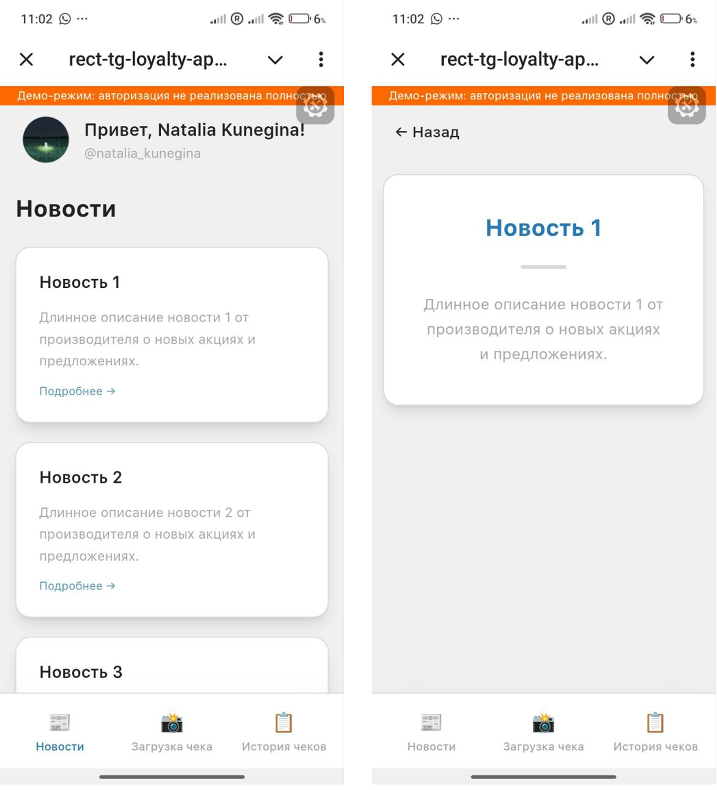
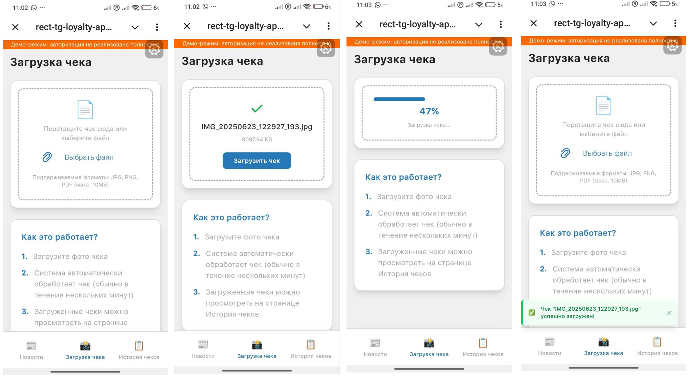
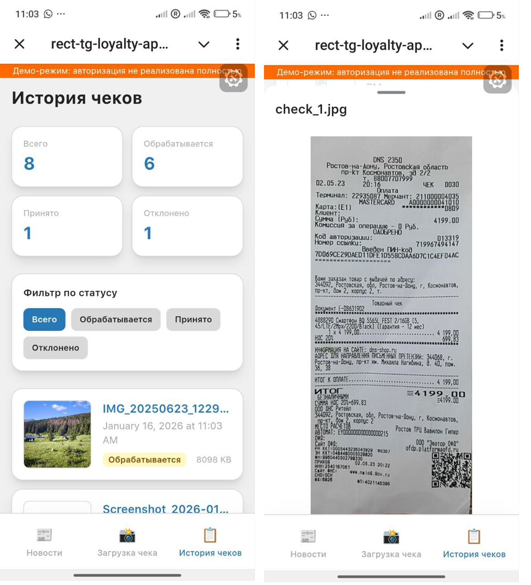

# Мини-приложения Telegram для регистрации чеков в программе лояльности производителя бытовой химии

Telegram Mini App на основе React Template

<div align="center">
  
  
  
</div>

## Технологии
- React 18 + TypeScript
- Vite (сборщик)
- @telegram-apps/sdk-react (интеграция с Telegram)
- @telegram-apps/telegram-ui (UI компоненты)
- React Router (навигация)

## Функционал
- [x] Авторизация через Telegram(в настоящий момент выполнена в демо-режиме без бэкенда, JWT и проверки хэша, для продакшн обязательно нужно сделать полноценную версию)
- [x] Просмотр новостей на главной странице(загрузка новостей из из mock API или статического JSON-файла)
- [x] Загрузка чеков с сохранением
- [x] Просмотр истории чеков
- [x] Локализация интерфейса

## Установка и запуск

### 1. Установка зависимостей
```bash
npm install
```

### 2. Запуск в режиме разработки
```bash
npm run dev
```

### 3. Настройка порта в VSCode
1. Открыть вкладку **Ports** в VSCode
2. Добавить порт **3000** (настроен в vite.config.ts)
3. Установить видимость как **Public**
4. Скопировать публичный URL и далее использовать в боте

### 4. Отладка в браузере
Открыть
```
http://localhost:3000/rect-tg-loyalty-app/
```
или публичный URL вида:
```
https://<ваш-tunnel-url>-<номер-порта>.euw.devtunnels.ms/<название-приложения>/
```
 - публичный URL из вкладки Ports


### 5. Тестирование в Telegram
1. Создать бота через @BotFather командой /newbot
2. Получить и сохранить токен API
3. Указать публичный URL в @BotFather командой /setdomain и задать название кнопки для взаимодействия 
4. Открыть созданного бота и тестировать 

### 6. Сборка
1. Установить зависимости
```
npm install
```
2. Запустить сборку production-версии:
```
npm run build
```


**Требования:**

* Node.js 16+
* npm 7+


**Переменные окружения:**

См. .env.example для примера.

**Путь к файлам сборки:**

/dist

### Режимы работы приложения

Приложение поддерживает два режима авторизации:

1. **Демо-режим** (по умолчанию, VITE_DEMO_MODE=true):
* Авторизация происходит только на клиенте, данные пользователя берутся из Telegram WebApp API (initDataUnsafe.user).
* Безопасность не гарантируется, подпись и валидность данных не проверяются.
* Используется только для демонстрации и разработки.
* В UI отображается оранжевое уведомление "Демо-режим: авторизация не реализована полностью".

2. **Безопасный режим (production)** (VITE_DEMO_MODE=false):
* Авторизация происходит через backend: клиент отправляет initData на заданный endpoint.
* Сервер валидирует подпись, возвращает валидированного пользователя и (опционально) JWT
* Пользователь и токен сохраняются для дальнейшей работы.
* В UI уведомление о демо-режиме не отображается.

#### Переключение режима

Режим задаётся переменной окружения в `.env.local`:
```
VITE_DEMO_MODE=true  # демо-режим (по умолчанию)
VITE_DEMO_MODE=false # безопасный режим (production)
```
